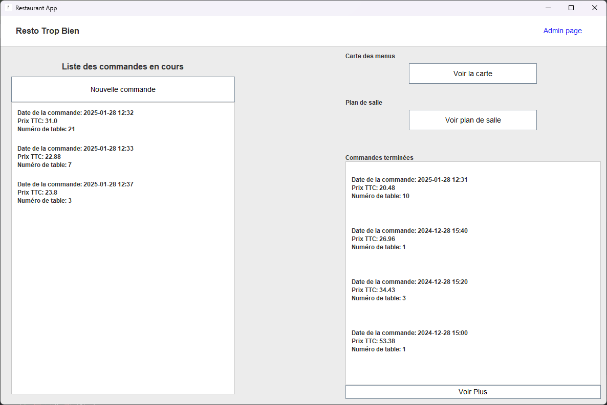
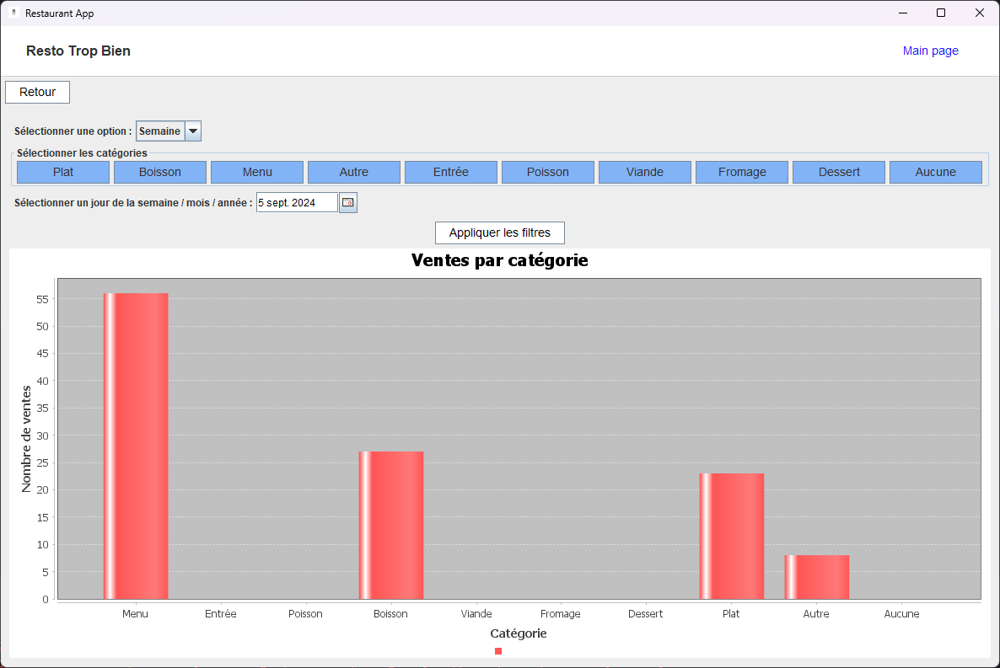
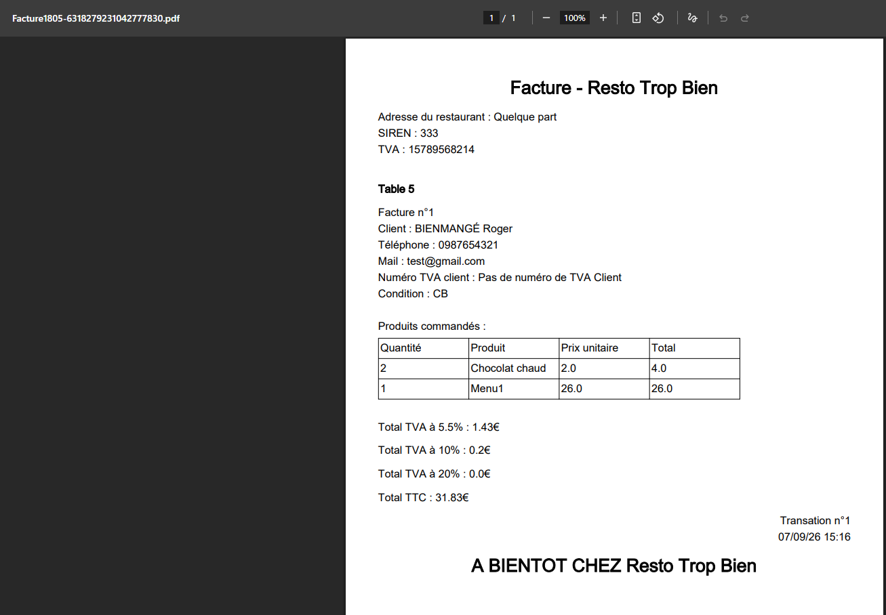
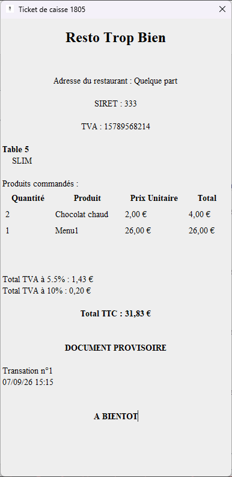
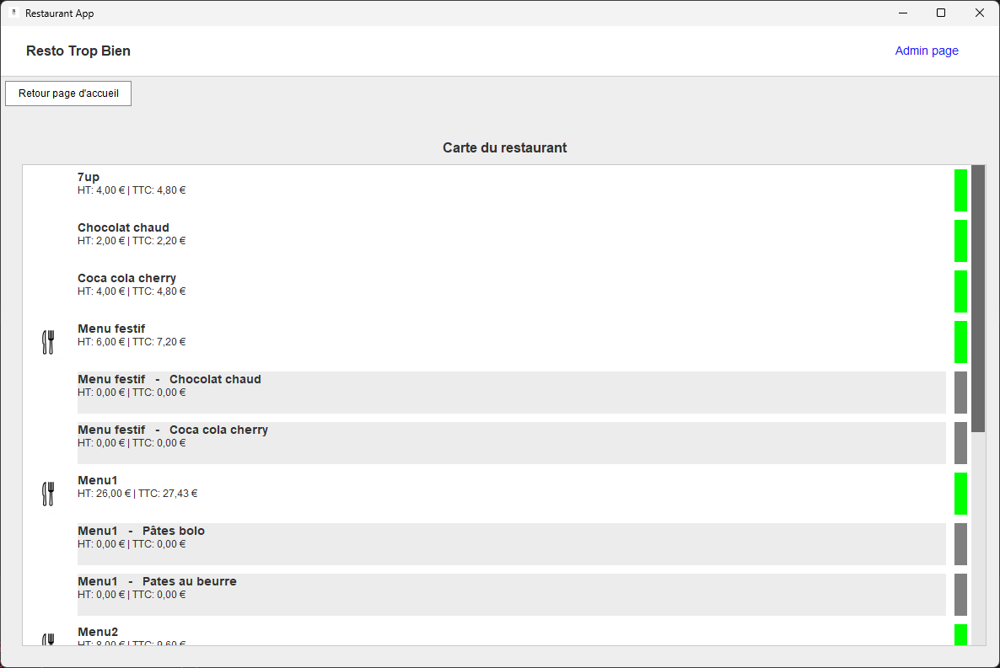
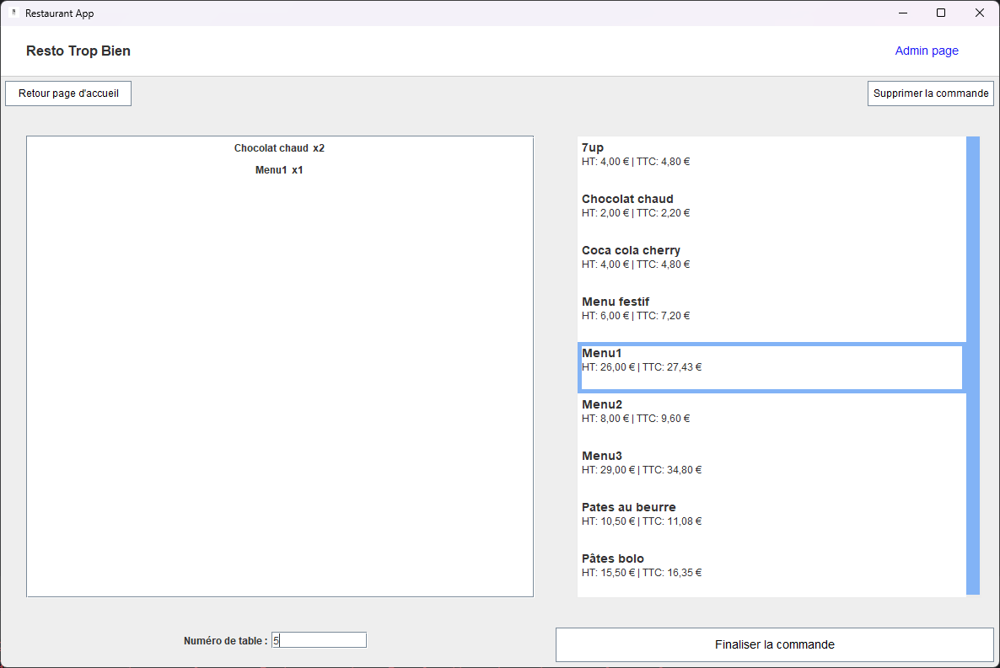

# Restaurant Project

Projet Java étudiant réalisé en 2 mois par 2 étudiants en 3ème année d'école d'ingénieur en Informatique et Industriel (IG2I Centrale Lille).

Le principe était de réaliser la conception de l'architecture et la réalisation d'une application de gestion de restaurant en Java. Nous avions une liste de contraintes à respecter qui ont tous été suivis.

Le projet a été réalisé avec JetBrains IntelliJ et DataGrip. L'utilisation de Maven, javax.swing et de la persistence des données étaient imposée.

Le visuel avec des couleurs ternes en nuances de gris était imposé dans les consignes pour des fins techniques et professionel. Pour que l'affichage ne soit pas divertissant mais pratique à utiliser. L'application étant fonctionnelle et pouvant s'utiliser sur un écran tactile de caisse par exemple.

Tout élément affiché est personnalisable (Nom du restaurant, numéro de SIREN, données des clients, etc...)

Voici quelques visuels (pas tous) de l'application :

**La page d'accueil**

**La page d'affichage des statistiques de ventes du restaurant en fonction du temps et des catégories**

**La page de facture (générée en PDF)**

**La page de ticket de caisse**

**La page d'affichage du menu (existe aussi en mode édition)**

**La page de modification de commandes**
